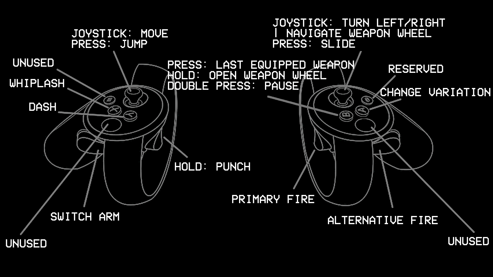
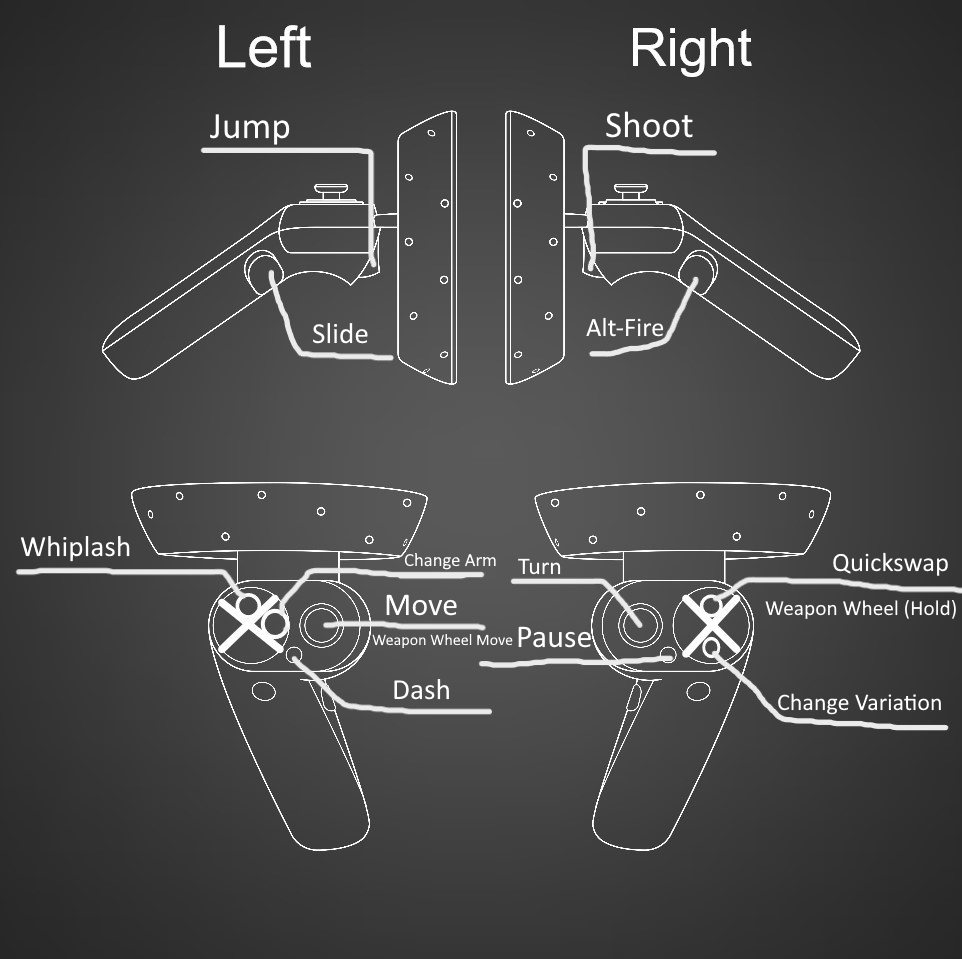

# VRTRAKILL
[Installation](https://github.com/whateverusername0/VRTRAKILL#installing-vrtrakill-in-less-than-10-steps) | [Common problems](https://github.com/whateverusername0/VRTRAKILL#common-issues) | [Default controller bindings](https://github.com/whateverusername0/VRTRAKILL#default-controller-bindings)

     
[Full minos fight (0.3)](https://www.youtube.com/watch?v=yrofGYf_xTI) | [Full sisyphus fight (0.5)](https://www.youtube.com/watch?v=DhcVx6yBEaM) | [Cybergrind tomfoolery (0.8)](https://youtu.be/n2aAljuvpMo) | (0.12) (coming soon)  

ULTRAKILLing in VR is now a thing.  
This mod exists because [HuskVR](https://github.com/TeamDoodz/HuskVR) is not being updated for like 7 months, so I was like "Fine, I'll do it myself"  
Also it does not require any other mods to function  

## Features
### What works right now:
- Camera, HUD, Crosshair
- Full movement (jump, dash, slide, slam storage, rocket ride, etc.)
- Full controller tracking (aiming / shooting, punching)
- Controller haptics (vibrations) (Rumble-based) (kinda broken)
- Weapon swap, weapon scroll using joystick, weapon wheel
- UI Interaction (some of the menus might be broken)
### Planned stuff:
~**0.x**: Hand gestures (thumbs up, point, etc.)~  
**0.12**: VR body (arms, legs, etc.)  
**1.0**: Full release (when i think that nothing more can be done)

## Requirements
- A copy of the latest version of ULTRAKILL (any kind)
- A VR compatible PC w/ SteamVR installed
- Any PCVR compatible headset

## Installing VRTRAKILL in less than 10 steps
VRTRAKILL Installation tutorial [here](https://www.youtube.com/watch?v=FcTysn8jwFQ) (@guesty5060 you're welcome)

The text version:
1. Make a copy of ULTRAKILL so you can safely mod that version without affecting your normal game:  
  1.1 Locate ULTRAKILL in your Steam library (or wherever you store it)  
  1.2 RMB -> Manage -> Browse local files  
  1.3 Make a copy of the ULTRAKILL folder and put it somewhere  
2. Get & Install [latest stable (at the moment) BepInEx 5.4.21](https://github.com/BepInEx/BepInEx/releases/tag/v5.4.21) that **matches your CPU architecture** into the new ULTRAKILL folder using [their guide](https://github.com/BepInEx/BepInEx/wiki/Installation). Make sure to run BepInEx'ed ULTRAKILL at least once so it can generate needed folders & files  
3. Download one of [releases](https://github.com/whateverusername0/VRTRAKILL/releases), unarchive and merge both ULTRAKILL folders  
4. Add the modded ULTRAKILL as a 'non-steam game' to steam so it can be run with SteamVR:  
  4.1 ADD A GAME (at the bottom left in library) -> Add a non-steam game -> select your VR-ed ULTRAKILL.exe  
  4.2 Right click on the new VR-ed ULTRAKILL in your steam library -> Properties -> Shortcut -> Include in VR Library  
5. Open SteamVR  
6. Select your VR-ed ULTRAKILL  
7. Run it once, wait for the error message to appear in the console and then exit  
8. Go to BepInEx/plugins, open VRTRAKILL_Config.json and set your preferences there. **Make sure you have the same keybinds both in config and in ULTRAKILL**  
9. Run VR-ed ULTRAKILL again  

## Build VRTRAKILL from source
Building from source video tutorial [here](https://www.youtube.com/watch?v=h1rS-p7aFFo) (@jackietanuki you're welcome)

The text version:
1. Download [Visual Studio 22](https://visualstudio.microsoft.com/vs/) with the c# development toolset thingie (should appear in the installer)  
2. Download VRTRAKILL source code (as zip file from [master branch](https://github.com/whateverusername0/VRTRAKILL/archive/refs/heads/master.zip) or from [releases](https://github.com/whateverusername0/VRTRAKILL/releases))  
3. Double click the .sln file (it should open vs22)  
4. Select VRTRAKILL project
5. Change the Debug thingie on top to Release  
6. Right mouse button on the VRTRAKILL project -> Build
7. Open the solution folder in file explorer and go to /bin
8. Copy the built dll to CopyToGameFolder/ULTRAKILL/BepInEx/plugins/VRTRAKILL
9. Enjoy

## Common issues:
1. Your gun is too big (or "twice the size of your head"):  
  - Solution: If you have SteamVR world size tweaked - disable it. If you set your weapon position to the middle - set it to the right. Else open an issue, because this shouldn't be happening :(  
2. On Valve Index you move too slowly and can't jump normally:  
  - Solution: In config there's an option "Do not override movement values". Enable it and launch the game again and see if it worked.
  - Solution 2 (applies to **all** devices): Try to lower the refresh rate of your headset.
3. Awful/missing HTC Vive, Index, etc. controller bindings:
  - Since I don't have those controllers you gotta make your own. It's pretty simple, there's no cryptic words in actions' names :)
  - Also if you wanna help you can always send me your controller bindings via discord or whatever and I'll set them as defaults so no more people have to suffer.
4. Literally any other problem, or recommendations to fixing them yourself:
  - If you have other mods enabled (like ultraballing, middle finger or sniper rifle), try disabling/removing them and see if things work.

## Default controller bindings:
### Oculus Touch (proudly made in MSPaint by me):

### HTC Vive - Missing :(

### Valve Index - Missing :(

### Windows Mixed Reality (made by ):

